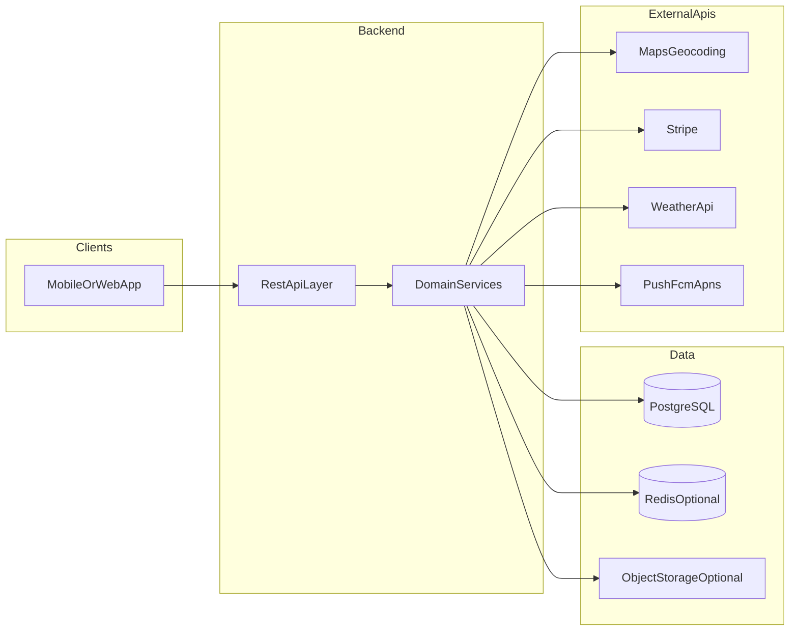

# 后端与数据层技术选型：团队讨论与决议声明

本文件由 **Autonomous Delivery App** 开发团队共同使用，用于在 **冲刺 0** 之前就后端运行时、主数据存储及强相关配套形成**可执行的团队共识**，并**书面记录**表决结果、责任人与版本。

**我们确认**，需求与节奏以 [ProductBacklog.md](ProductBacklog.md)（功能与用户故事）及 [SprintReleasePlan.md](SprintReleasePlan.md)（冲刺安排与冲刺 0 任务）为准。

---

## 1. 本次决策范围声明

我们约定：下列事项**纳入**本轮技术选型讨论与表决；下列事项**刻意不纳入**，以免会议失焦。

| 纳入本轮决策 | 不纳入本轮决策 |
|--------------|----------------|
| 后端编程语言与 Web 框架 | 前端框架（React / React Native 等）的最终选择 |
| 主事务数据库及是否启用空间扩展（PostGIS） | UI 设计系统与组件库 |
| 是否引入缓存（如 Redis）、对象存储（交付照片） | 第三方地图/支付厂商的商务条款（除非直接影响架构） |
| 实时跟踪实现形态的**原则性**选择（WebSocket 与轮询） | 具体云厂商账号与计费细则 |

---

## 2. 我们共同承认的需求边界

下列能力来自产品待办与冲刺计划，**我们一致承认**其将直接约束后端与数据层设计：

| 能力域 | 团队共识描述 |
|--------|----------------|
| 身份与账户 | 邮箱/手机注册、OTP、密码登录、JWT、后续 OAuth（Google/Apple） |
| 地理与地址 | 地址存储、旧金山服务区域校验（地理围栏）、距离与路线相关计算（三配送中心、推荐引擎） |
| 交易与状态 | 订单创建、Stripe 支付、促销码、订单历史；支付与库存须具备一致性与可追溯性 |
| 调度与展示 | 三中心车辆可用性、ETA/定价、PIN/QR；实时地图跟踪（WebSocket 或轮询） |
| 媒体与通知 | 交付照片上传与展示；接近推送（依赖后端触发逻辑） |
| 外部集成 | 地图/地理编码、Stripe、天气 API、推送（FCM/APNs）等 |

**节奏声明**：我们须在 **冲刺 0** 内确定技术栈与数据库模式；整体约 **10 周** 推进至 MVP 及后续增强（详见 [SprintReleasePlan.md](SprintReleasePlan.md)）。  
**背景说明**：冲刺 0 任务曾列举「Node.js / Python Flask」脚手架、REST API 与 Swagger/Postman 契约（T-0.3、T-0.6），**我们将其视为候选起点，而非唯一选项**。

---

## 3. 系统边界共识（逻辑架构）

下图用于**团队对齐**：后端承担哪些持久化与集成，与地图、支付等外部系统如何分界。

---

## 4. 后端语言 / 框架：供团队审议的候选方案

我们列出以下三类候选，与**课程/项目周期及团队规模**相匹配。每一类均从**与待办故事的对应关系**及**非功能性需求（NFR）**两方面陈述，供团队在同一标尺下比较。

---

### 方案 A：Node.js + TypeScript（Express 或 Fastify）

- **与产品能力的对应关系**：Stripe 官方 SDK 与社区实践丰富；WebSocket 与实时场景常见（如跟踪）；若前端为 React/TS，类型与工具链可部分对齐（可选，非必须）。
- **我们评估时关注的 NFR**：开发速度与 npm 生态对 **交付速度**、**可维护性** 的影响；事件循环模型下，若推荐算法在服务端大量占用 CPU，须关注 **性能**（可通过纯函数拆分、限流或后续优化应对）；容器镜像小、冷启动快，有利于 **部署效率与资源成本**。
- **团队须共同留意的风险**：异步与错误处理风格需统一；对 `any` 的滥用将直接损害 **可维护性**。

---

### 方案 B：Python + FastAPI（或 Flask，以团队熟练度为准）

- **与产品能力的对应关系**：冲刺计划已提及 Flask；FastAPI 与 OpenAPI 契合度高，有利于冲刺 0 的 **API 契约**（Swagger/Postman）；数值与规则原型迭代快，有利于 **推荐引擎** 与业务规则调整。
- **我们评估时关注的 NFR**：语法与可读性对 **团队技能匹配**、协作效率的影响；FastAPI 异步与同步混用须有明确约定，否则影响 **可维护性**；生产部署须固化进程模型（如 Uvicorn/Gunicorn），并写入运行文档，体现 **可运维性**。
- **团队须共同留意的风险**：若团队更熟悉同步 Flask 而非异步，引入 FastAPI 的学习成本须计入 **上市时间**。

---

### 方案 C：Java 或 Kotlin + Spring Boot

- **与产品能力的对应关系**：安全、事务、OAuth、支付集成等企业级模式资料充分；强类型有利于 **订单与支付** 等领域建模。
- **我们评估时关注的 NFR**：生态成熟度与 **可演进性**；在「每周总工时有限」的前提下，样板与配置量可能拉长早期冲刺，影响 **上市时间**；内存与启动时间通常高于轻量运行时，影响 **资源成本**（云主机规格）。
- **团队须共同留意的风险**：若成员 Java 经验不均，**交付速度** 与 **可维护性** 可能出现明显分化。

---

### 方案 A / B / C 对照（非功能性）

| NFR 维度 | 方案 A Node+TS | 方案 B Python FastAPI | 方案 C Spring Boot |
|----------|----------------|------------------------|---------------------|
| 交付速度（MVP） | 高（生态与全栈语言一致） | 高（尤其算法与契约快速） | 中（视团队经验） |
| 团队技能匹配 | 取决于 TypeScript 熟悉度 | 通常易读 | 取决于 Java/Kotlin 背景 |
| 事务与支付正确性 | 可实现，依赖规范与测试 | 可实现，依赖规范与测试 | 强类型与生态成熟 |
| 实时与连接扩展 | WebSocket 成熟 | 需选型（如 Starlette/Socket） | 成熟（WebSocket/STOMP） |
| 运维与托管 | 轻量、常见 | 需明确进程模型 | 成熟、资源占用较高 |
| 长期演进 | 中等 | 中等 | 高（大型企业常见） |

---

## 5. 数据库与数据存储：团队审议要点

### 5.1 主事务库：PostgreSQL（本文件列出的**默认审议候选**）

- **与产品能力的对应关系**：用户、订单、支付状态机、车辆库存、促销码等适合 **关系模型 + ACID**；与 Stripe 对账、退款、幂等键依赖 **一致性**。
- **我们评估时关注的 NFR**：托管产品成熟（如 RDS、Cloud SQL、Azure Database）；**PostGIS** 扩展可支撑旧金山服务边界、点与多边形关系、距离计算（与 US-2.2、US-4.1 一致），减少业务层手写几何逻辑，降低 **错误率** 与 **可维护性** 成本。
- **若不采用 PostGIS**：我们承认可采用预存多边形 + 应用层判断或简化经纬度边界，**实现可能更快**，但在 **复杂边界** 上更易出错；**我们须在评审中明确**责任人与测试策略。

---

### 5.2 缓存 / 会话 / 限流：Redis（作为**配套层**提请团队表决）

- **与产品能力的对应关系**：OTP 限流、热点读（天气、地理编码缓存）、可选的 **JWT 黑名单**、实时位置短期缓存或 pub/sub（取决于架构）。
- **我们评估时关注的 NFR**：低延迟带来的 **性能**；持久化、高可用与备份策略所要求的 **可靠性**；密钥与网络隔离所要求的 **安全**。

---

### 5.3 二进制大对象：对象存储（S3 兼容或开发用 MinIO）

- **与产品能力的对应关系**：交付照片（US-6.4）不宜长期以 BYTEA 形式堆放在 PostgreSQL 内。
- **我们评估时关注的 NFR**：生命周期与存储类策略对 **成本** 的影响；预签名 URL、私有桶与最小权限对 **安全** 的要求；CDN 与缓存策略对 **性能** 的贡献。

---

## 6. 实时跟踪与外部集成：团队须遵守的 NFR 原则

### 6.1 实时跟踪：WebSocket 与轮询

我们承认冲刺风险登记中已将轮询列为备选。团队比较两种形态时，至少须讨论下列 **NFR**：

| 维度 | WebSocket | 轮询（如每 5s） |
|------|-----------|-------------------|
| 服务端连接与扩展 | 有状态连接，需水平扩展策略 | 无状态请求多，易扩展 |
| 客户端电量与网络 | 相对友好（长连接） | 请求更频繁，需权衡间隔 |
| 实现复杂度 | 略高 | 较低 |

**团队约定**：MVP 阶段须选定一种形态并写入项目文档；若选用 WebSocket，**我们须书面约定**心跳、超时与重连行为。

---

### 6.2 外部依赖（与具体语言无关的团队原则）

下列原则**适用于全体后端成员**，与所选语言无关：

| 领域 | 我们承诺关注的 NFR 要点 |
|------|-------------------------|
| 地图 / 地理编码 | 超时、重试、配额与降级（含缓存上次结果） |
| Stripe | 幂等键、Webhook 签名校验、测试模式与生产密钥隔离 |
| 天气 / 推送 | 超时、重试、不阻塞主支付路径 |
| 密钥 | 环境变量或密钥管理服务，禁止入库 |

---

## 7. 表决程序与评分表

**我们采用下列程序**：成员通读本文件 → 依下表维度独立或小组评分 → 召开会议表决 → 填写第 8 节「决议区」并归档。

**评分规则（可协商）**：每个维度 1–5 分（1=很不适合，5=很适合），或仅用「高 / 中 / 低」；权重由会议当场确认。

| 评分维度 | 权重（可选） | 方案 A Node+TS | 方案 B Python | 方案 C Spring |
|----------|--------------|----------------|-----------------|---------------|
| 团队熟悉度 | | | | |
| MVP 交付速度 | | | | |
| 与 REST/OpenAPI 契合度 | | | | |
| 事务与支付正确性（信心） | | | | |
| 地理与实时能力扩展 | | | | |
| 运维与托管成熟度 | | | | |
| 文档与招聘生态 | | | | |
| **加权总分** | | | | |

**数据层专项表决（是 / 否）**：

| 表决项 | 是否采纳 |
|--------|----------|
| 主库采用 PostgreSQL | |
| 启用 PostGIS（若否，须记录替代方案） | |
| 引入 Redis | |
| 对象存储承载交付照片 | |

---

## 8. 决议区（经表决后由负责人填写）

本表一经填写，即视为**本团队对后端与数据层选型的正式记录**。

| 项目 | 决议内容 |
|------|----------|
| 后端运行时与框架 | 例如：Node.js 22 LTS + Fastify + TypeScript |
| 主数据库 | 例如：PostgreSQL 16 + PostGIS |
| 缓存 | 例如：Redis 7 / 否 |
| 对象存储 | 例如：MinIO（开发）/ S3 兼容（生产） |
| 实时跟踪策略 | 例如：WebSocket / 轮询 5s |
| 负责人 | |
| 决议日期 | |
| 版本 | |

---

## 9. 修订记录

| 版本 | 日期 | 说明 |
|------|------|------|
| 1.0 | （待定） | 初稿，供团队讨论表决 |
| 1.1 | （待定） | 措辞调整为团队声明体，不改变技术实质 |
