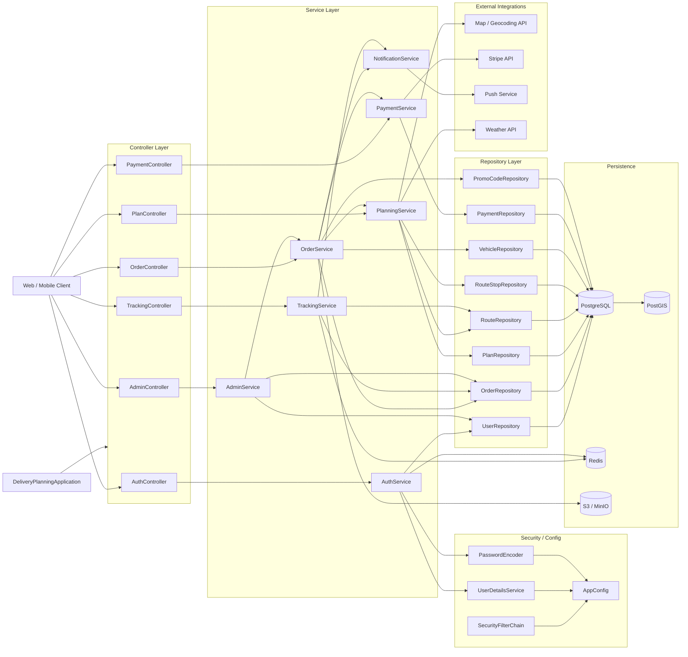
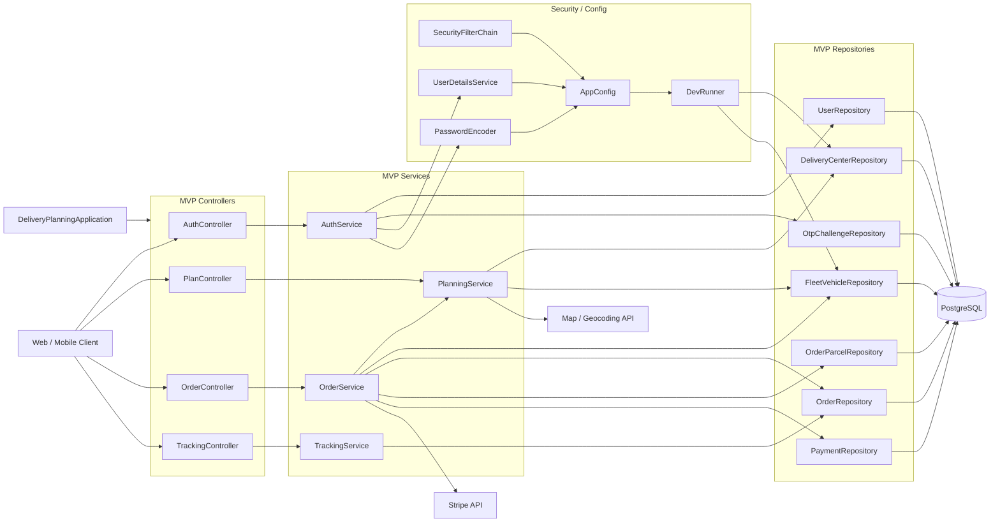
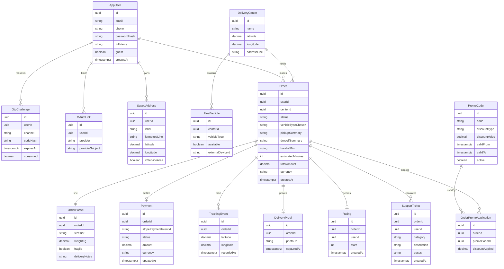

# Java 后端分层架构与数据库 ER（自治配送）

本文档记录团队在选定 **Java（Spring Boot）+ PostgreSQL** 后的**目标后端结构**，与先前 **OnlineOrder** 类项目（Controller → Service → Repository）保持一致，便于快速对齐分工与包结构。领域需求来源：[ProductBacklog.md](ProductBacklog.md)。

---

## 1. 团队决议摘要

- **运行时**：Java，建议 **Spring Boot** 作为 Web 与依赖注入容器。
- **主库**：**PostgreSQL**；服务区域与距离计算可采用 **PostGIS** 几何列，或在应用层用规则/经纬度实现（与 [BackendTechStackDiscussion.md](BackendTechStackDiscussion.md) 一致）。
- **分层约定**：HTTP 入口仅落在 **Controller**；业务规则与编排落在 **Service**；持久化仅通过 **Repository** 访问数据库。
- **外部系统**：支付、地图、天气、推送、对象存储等与业务服务协作，**不**下沉到 Repository 层直接调用。

---

## 2. 分层架构图（Controller → Service → Repository → PostgreSQL）

下图为**目标态（含 P1/P2 扩展面）**的端到端结构：风格对齐 **OnlineOrder** 类项目（Controller → Service → Repository → DB），并补充 **Notification**、多类 **Persistence** 与 **External Integrations**。**MVP 最小协作视图**见 **§2.2**。实现时可在包内继续拆分私有类，不必与图中每个框一一对应。

### 2.1 各层职责（与 §2 全量图命名对齐）

下表与 **§2 分层架构图**中的 Controller / Service 名称一致，描述**目标态**职责（含 P1/P2 扩展面）。实现时仍可在包内拆私有类。

| 组件 | 掌管范围（可再在内部分文件/私有类） |
|------|--------------------------------------|
| **AuthController → AuthService** | **身份与凭证**：注册、登录、OTP、JWT；与 **UserDetailsService**、**PasswordEncoder**、**AppConfig** 协同；可按需使用 **Redis** 做 OTP 限流或会话（非 MVP 必选）。 |
| **PlanController → PlanningService** | **下单前规划**：地址持久化与服务区域校验（US-2.x）、包裹约束输入与校验（US-3.x）、推荐/报价与中心—车队只读（US-4.x）；编排 **地图 / 地理编码**、**天气**（P2）等外部调用；读写 **Plan / Route / RouteStop** 等仓储（若团队将路线落库）。 |
| **OrderController → OrderService** | **订单与金额侧**：订单创建与状态、与 **PlanningService** 衔接方案、与 **PaymentService** 衔接支付；促销码（P1）、**通知**触发；读写订单、车辆占用、促销相关仓储。 |
| **PaymentController → PaymentService** | **支付网关**：Stripe 意图、确认与 Webhook、本地 **Payment** 记录；金额与幂等以服务端为准。 |
| **TrackingController → TrackingService** | **履约可视化**：轨迹查询与模拟推送、订单状态；可读 **Route** 等；**Redis** 可用于热点轨迹缓存；与 **NotificationService** 协作接近提醒（P1）。 |
| **AdminController → AdminService** | **运营/内部能力**：查询用户与订单、运维操作（具体以团队范围为准）；**非用户 MVP 必经路径**，可与种子脚本分工。 |
| **NotificationService** | **出站通知**：推送（FCM/APNs）等；被 **OrderService** / **TrackingService** 调用（P1）。 |
| **Repository** | 按聚合根或表拆分；各 Service 只通过 Repository 访问 **PostgreSQL**（及可选 **PostGIS**）。 |
| **Security / Config** | **SecurityFilterChain**、**UserDetailsService**、**PasswordEncoder** 汇入 **AppConfig**；**DeliveryPlanningApplication** 为 Spring Boot 入口。 |
| **Persistence（PostgreSQL 等）** | 主库 **PostgreSQL**；**PostGIS** 可选；**Redis**、**S3/MinIO** 为增强能力承载。 |
| **External Integrations** | 地图、Stripe、推送、天气等由对应 Service 编排，**不**在 Repository 内直连。 |

---

### 2.2 MVP 简版结构图（任务拆分用）

本图仅覆盖 [ProductBacklog.md](ProductBacklog.md) 中 **P0**（至冲刺 5、可发布 MVP）：认证、地址与围栏、包裹尺寸/重量、推荐与可用车辆、结账与 Stripe、地图跟踪与 PIN、订单历史。**不**包含：促销码（P1）、推送（P1）、交付照片与对象存储（P1）、天气（P2）、**AdminController** 用户面、**NotificationService**、**PaymentController** 独立拆分（支付编排并入 **OrderService** 与同套 **OrderController** 路由）。与 §2 全量图**并存**，用于冲刺分工与估点。

**MVP 图说明（持久化）**：仅 **PostgreSQL**；服务区域与距离可在库侧用 **PostGIS** 扩展，或由 **PlanningService** 用经纬度规则实现（与团队决议一致）。**不画** `PlanRepository` / `RouteRepository` / `RouteStopRepository` 时，表示 MVP 阶段路线与方案多在服务内计算并写入 **Order** 字段；若后续与 §2 全量对齐再落独立表。

**非 MVP（回到 §2 全量图再引入）**：`PaymentController` 独立拆分、`AdminController`、`NotificationService`、**Redis**、**S3/MinIO**、**Weather**、**Push**、**PromoCodeRepository**、常用地址表（US-2.3，P1）等。

#### MVP 各块职责与任务分配（示例）

「负责人」列为占位，冲刺规划会上填写。

| Block | MVP 职责（对齐 P0） | 主要用户故事 | 可分配任务示例 | 负责人 |
|-------|---------------------|--------------|----------------|--------|
| **AuthController / AuthService** | 注册、登录、OTP、密码哈希、JWT 颁发与校验入口；衔接 **UserDetailsService** / **PasswordEncoder** | US-1.1、US-1.2 | Sprint 1：注册/登录 API + 集成测试骨架 | |
| **PlanController / PlanningService** | 取/送货地址校验、旧金山服务区域判断；包裹尺寸与重量校验；三中心距离与车队可用性、ETA/定价选项（机器人 vs 无人机） | US-2.1、US-2.2、US-3.1、US-4.1–US-4.3 | Sprint 2–3：围栏与推荐 API；对接地图 API（服务端校验/缓存策略） | |
| **OrderController / OrderService** | 订单摘要、创建订单、**Stripe 支付意图与 Webhook（MVP 路由挂在 Order 面）**、支付成功后落单、订单历史列表 | US-5.1、US-5.2、US-7.1 | Sprint 4–5：结账与支付管道、订单 ID 与历史查询 | |
| **TrackingController / TrackingService** | 订单履约状态、**模拟**车辆位置流（或轮询）、**handoff PIN** 生成与读取 | US-6.1、US-6.2 | Sprint 5：跟踪 API + 与前端地图联调 | |
| **MVP Repositories** | 仅访问上表所列表：用户、OTP、中心、车队、订单、包裹、支付 | （支撑上述故事） | Sprint 0–1：实体与迁移与种子数据对齐 | |
| **Security / Config** | **SecurityFilterChain**、JWT 过滤器（若采用）、**AppConfig** | 横切 | Sprint 0：安全骨架与开发配置 | |
| **DevRunner** | 启动时或 profile=dev 下写入 **三配送中心 + 模拟车辆库存** | 冲刺 0 种子 | Sprint 0：与 **DeliveryCenterRepository**、**FleetVehicleRepository** 对接 | |

---

## 3. 与外部系统的边界（文字约定）

| 外部能力 | 典型集成点 | 说明 |
|----------|------------|------|
| **Stripe** | **目标态**：`PaymentService` + `PaymentController`；**MVP**：`OrderService`（`OrderController` 上支付与 Webhook 路由） | 支付意图、Webhook 签名校验、幂等；金额以服务端为准。 |
| **地图 / 地理编码** | `PlanningService` | 自动完成可在前端；服务端负责持久化与围栏校验（US-2.2）。 |
| **天气 API** | `PlanningService` 内客户端（P2） | 影响无人机可选性（US-4.4）。 |
| **推送 FCM/APNs** | `NotificationService`（P1），由 `OrderService` / `TrackingService` 触发 | 接近触发（US-6.3）。 |
| **对象存储** | `OrderService` 或独立交付服务（P1） | 照片预签名 URL，库中仅存 URL（US-6.4）。 |

---

## 4. 数据库 ER 图（概念模型）

以下为 **PostgreSQL 概念模型**，字段可在实现阶段微调；地理信息可用 `latitude` / `longitude` 或 PostGIS `geometry`。

### 4.1 实体字段概要（实现对照）

| 实体 | 主键 / 外键 | 关键业务字段 |
|------|-------------|----------------|
| **AppUser** | `id`；`email`/`phone` 唯一 | `passwordHash`（访客可空）、`guest` |
| **OtpChallenge** | `id`；可选关联注册用户 | `codeHash`、`expiresAt`、`consumed` |
| **OAuthLink** | `id`；`userId` → AppUser | `provider`、`providerSubject` |
| **SavedAddress** | `id`；`userId` → AppUser | `latitude`/`longitude`、`inServiceArea` |
| **DeliveryCenter** | `id` | 三中心种子；坐标用于 US-4.1 |
| **FleetVehicle** | `id`；`centerId` → DeliveryCenter | `vehicleType`、`available`（US-4.3） |
| **Order** | `id`；`userId` 可空；`centerId` | `status`、`vehicleTypeChosen`、`handoffPin`（US-6.2）、`totalAmount` |
| **OrderParcel** | `id`；`orderId` 1:1 | `sizeTier`、`weightKg`、`fragile`、`deliveryNotes` |
| **Payment** | `id`；`orderId` 1:1 | `stripePaymentIntentId`、`status` |
| **PromoCode** | `id`；`code` 唯一 | 折扣类型与区间（US-5.3） |
| **OrderPromoApplication** | `orderId` + `promoCodeId` | `discountApplied` |
| **TrackingEvent** | `id`；`orderId` | 轨迹点序列（US-6.1） |
| **DeliveryProof** | `orderId` 1:1 | `photoUrl`（US-6.4） |
| **Rating** | `orderId` 1:1 | `stars`（US-7.2） |
| **SupportTicket** | `id`；`orderId`、`userId` | `category`、`description`（US-7.3） |

---

## 5. 修订记录

| 版本 | 日期 | 说明 |
|------|------|------|
| 1.0 | 2026-03-24 | 初稿：Spring 分层图 + PostgreSQL ER 与字段概要 |
| 1.1 | 2026-03-24 | 全量架构改为 LR 图：Auth / Plan / Order / Tracking / Payment / Admin + Notification；Persistence 含 PostGIS、Redis、对象存储 |
| 1.2 | 2026-03-24 | 新增 §2.2 MVP 简版图与任务表；§2.1 与 §2 命名对齐；§3 集成点与 MVP/目标态区分 |
