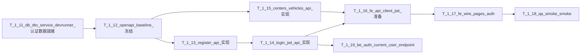

# Sprint 1 Backlog（认证 & 应用外壳）

本冲刺聚焦用户认证链路与应用外壳闭环：完成注册/OTP/登录、JWT 认证、中心与车辆数据的可读 API；并在前端侧把既有页面的占位登录态替换为后端接口调用与最小的联调闭环（不新增高保真 UI 设计）。

规划来源见 [SprintReleasePlan.md](../project_backlog/SprintReleasePlan.md)；ER 基准见 [JavaBackendArchitecture.md](../project_backlog/JavaBackendArchitecture.md)。

---

## 1. 进度图例

| 符号 | 含义      | 参与同学（含出勤/工时记录） |
| ---- | --------- | --------------------------- |
| ✅   | 已完成    | —                           |
| 🔄   | 进行中    | —                           |
| ⬜   | 未开始    | —                           |
| ⏭️   | 跳过/延后 | —                           |

---

## 2. 冲刺目标（Sprint 1）

1. 完成注册/OTP/登录的后端认证 API，并实现 JWT 颁发与校验。
2. 认证通过后可访问中心与车辆相关数据（满足后续推荐/路线计算所需的最小读接口）。
3. 在前端侧实现与后端认证 API 的接口联调准备：补齐 API client/请求-错误映射，并把占位登录态替换为后端 JWT。
4. 用端到端 smoke 测试覆盖关键成功/失败路径，确保最小闭环可用。

---

## 3. 任务清单（T-1.xx）

| 任务 ID  | 任务描述                                                                                                                                                                                                | 分配角色        | 预计小时   | 前置依赖 | 进度 | 参与同学（含出勤/工时记录） |
| -------- | ------------------------------------------------------------------------------------------------------------------------------------------------------------------------------------------------------- | --------------- | ---------- | -------- | ---- | --------------------------- |
| `T-1.11` | 承接 Sprint0 延后的数据库 DTO/Service/DevRunner：补齐认证所需的数据读写校验（包括 `app_user`、`otp_challenge` 以及认证后可读的中心/车辆 DTO 与服务调用路径），并保证 `dev` 环境启动校验通过且日志可核对 | 后端开发 × 1~2  | 6          | `T-0.12` | ⬜   | @Qiyuan Huang               |
| `T-1.12` | 建立并冻结 OpenAPI baseline：将注册/登录/JWT 与中心/车辆相关端点的请求/响应模型固化为单一事实来源，确保可用于前后端联调对齐（生成并导出 baseline 文件或可访问的契约页面）                               | 后端 Lead × 1   | 4          | `T-1.11` | ⬜   | @Qiyuan Huang               |
| `T-1.13` | 后端 P0：注册 API（邮箱/电话、OTP 发送、OTP 校验、密码哈希、优雅失败与关键错误码）并与 OpenAPI 契约对齐                                                                                                 | 后端 Lead × 1~2 | 4          | `T-1.12` | ⬜   | @Qiyuan Huang, @Yanjia Kan  |
| `T-1.14` | 后端 P0：登录 API（JWT 颁发）与受保护资源的鉴权语义（JWT 校验、权限错误处理）并与 OpenAPI 契约对齐                                                                                                      | 后端 Lead × 1~2 | 3          | `T-1.13` | ⬜   | @Qiyuan Huang, @Lei Feng    |
| `T-1.15` | 后端 P0：中心 & 车辆 CRUD（至少实现认证后可读取的列表/详情；覆盖 `delivery_center` 与 `fleet_vehicle` 的最小读与必要写/状态变更接口）                                                                   | 后端开发 × 2    | 3          | `T-1.12` | ⬜   | @Hangyi Gan, @Yanjia Kan    |
| `T-1.16` | 前端接口粒度：补齐后端 API client（register/login/OTP、JWT 存储与使用策略、统一错误映射；先不做高保真 UI）                                                                                              | 前端 Lead × 1~2 | 3          | `T-1.14` | ⬜   | @Yuyang Zhou, @Yiyuan Miao  |
| `T-1.17` | 前端接口联调：把 `LoginPage`/`RegisterPage` 从占位逻辑替换为真实接口调用，并让 `AuthContext`/`ProtectedRoute` 使用后端 JWT（成功/失败均有可理解的 UI 反馈）                                             | 前端 Lead × 1~2 | 3          | `T-1.16` | ⬜   | @Yuyang Zhou, @Jiayi Gao    |
| `T-1.18` | QA：完成注册/登录端到端 smoke（快乐路径 + 关键失败：重复账户、错误凭证、OTP 错误/过期），并输出可复现的测试证据                                                                                         | QA/测试 × 1~2   | 2          | `T-1.17` | ⬜   | @Yuyang Zhou, @Jiayi Gao    |
| `T-1.19` | 后端独立 feature：新增“当前登录用户信息接口”（`/auth/me` 或等价受保护端点），登录后可返回当前用户基础资料、认证状态与关键鉴权字段，作为 JWT 生效后的独立验证入口 | 后端开发 × 1    | 3          | `T-1.14` | ⬜   | @Sida Xue                   |
|          |                                                                                                                                                                                                         | **冲刺总计**    | **31小时** | —        | —    | —                           |

---

## 3.1 可直接下发的子任务拆分

> 下面这一版是按“尽量减少互相等待、每人有清晰 ownership、PR 容易验收”来拆的。建议每个子任务只设 1 个主负责人，最多 1 个配合人。

| 子任务 ID | 对应主任务 | 可直接发下去的内容                                                                                             | 建议主负责人  | 建议配合人    | 交付物 / 完成标志                                   |
| --------- | ---------- | -------------------------------------------------------------------------------------------------------------- | ------------- | ------------- | --------------------------------------------------- |
| `T-1.11a` | `T-1.11`   | 补齐 `app_user` / `otp_challenge` 的 DTO、Service、查询接口（按邮箱/手机号查用户、查最新 OTP、创建/消费 OTP）  | @Qiyuan Huang | @Yanjia Kan   | Service 可被注册/登录流程直接调用，`dev` 启动无报错 |
| `T-1.11b` | `T-1.11`   | 补齐 `delivery_center` / `fleet_vehicle` 的 DTO、Service、最小读路径                                           | @Hangyi Gan   | @Lei Feng     | Service 可返回中心列表、车辆列表/详情               |
| `T-1.11c` | `T-1.11`   | 完善 DevRunner / seed 校验日志，启动时打印关键表数量与样例数据                                                 | @Qiyuan Huang | @Hangyi Gan   | `dev` profile 启动日志可作为验收证据                |
| `T-1.12a` | `T-1.12`   | 整理 Sprint 1 需要冻结的接口清单：register、send OTP、verify OTP / complete register、login、centers、vehicles | @Qiyuan Huang | @Yuyang Zhou  | 一份固定端点清单，前后端都认这份                    |
| `T-1.12b` | `T-1.12`   | 生成并固定 OpenAPI / Swagger 入口，补齐请求体、响应体、错误体模型                                              | @Qiyuan Huang | @Lei Feng     | swagger UI 地址或导出文件路径固定                   |
| `T-1.13a` | `T-1.13`   | 实现发送 OTP 接口：参数校验、生成 OTP、落库、重复账户拦截                                                      | @Yanjia Kan   | @Qiyuan Huang | Postman 可打通“发送 OTP”成功/失败路径               |
| `T-1.13b` | `T-1.13`   | 实现完成注册接口：校验 OTP、创建/激活用户、密码哈希、错误码对齐                                                | @Qiyuan Huang | @Yanjia Kan   | 新用户可注册成功，密码不落明文                      |
| `T-1.14a` | `T-1.14`   | 实现登录接口：账号密码校验、JWT 颁发、返回 token 结构                                                          | @Qiyuan Huang | @Lei Feng     | 登录成功拿到 JWT                                    |
| `T-1.14b` | `T-1.14`   | 实现 JWT 校验、受保护路由、401/403 错误处理                                                                    | @Lei Feng     | @Qiyuan Huang | 带 token 可访问，不带/错 token 被拦截               |
| `T-1.15a` | `T-1.15`   | 实现中心列表 / 详情接口，字段与 DTO / OpenAPI 对齐                                                             | @Hangyi Gan   | @Yanjia Kan   | 登录后可读中心数据                                  |
| `T-1.15b` | `T-1.15`   | 实现车辆列表 / 按中心查询接口；如来得及再补状态变更接口                                                        | @Yanjia Kan   | @Hangyi Gan   | 登录后可读车辆数据                                  |
| `T-1.16a` | `T-1.16`   | 前端统一 API client：封装 `sendOtp` / `register` / `login` / `fetchCenters`                                    | @Yiyuan Miao  | @Yuyang Zhou  | 页面不再直接写裸 `fetch`                            |
| `T-1.16b` | `T-1.16`   | JWT 存储、请求注入、统一错误对象映射                                                                           | @Yuyang Zhou  | @Yiyuan Miao  | 受保护请求自动带 token，错误结构统一                |
| `T-1.17a` | `T-1.17`   | 把 `RegisterPage` 接到真实接口，覆盖发送 OTP / 完成注册 / 错误提示                                             | @Jiayi Gao    | @Yuyang Zhou  | 浏览器里能真实注册，错误场景有提示                  |
| `T-1.17b` | `T-1.17`   | 把 `LoginPage`、`AuthContext`、`ProtectedRoute` 接到 JWT 流程                                                  | @Yuyang Zhou  | @Jiayi Gao    | 登录后能进受保护页面，退出后回登录页                |
| `T-1.18a` | `T-1.18`   | 编写 smoke checklist：happy path + 重复账户 + 错密码 + 错/过期 OTP                                             | @Jiayi Gao    | @Hao Chen     | 一份可复测的 checklist / 测试说明                   |
| `T-1.18b` | `T-1.18`   | 收集证据：截图、Postman 请求/响应、必要日志                                                                    | @Jiayi Gao    | @Yuyang Zhou  | PR / 测试报告里可直接贴证据                         |
| `T-1.19a` | `T-1.19`   | 新增 `/auth/me`（或等价 `current-user` 端点）：补齐响应 DTO、从 Security Context / JWT 解析当前用户、必要时回查用户表，并与 OpenAPI 契约对齐 | @Sida Xue     | @Lei Feng     | 登录后带合法 JWT 可返回当前用户信息；未登录或 token 无效时返回一致的鉴权错误 |

## 3.2 任务分配

### A. 任务分配

- `@Qiyuan Huang`： `T-1.11a`、`T-1.11c`、`T-1.12a`、`T-1.12b`、`T-1.13b`、`T-1.14a`。负责把认证链路和 OpenAPI 基线先立住。
- `@Yanjia Kan`：`T-1.13a`、`T-1.15b`，配合 `T-1.11a` / `T-1.13b`。重点是 OTP 和车辆接口，两块都能并行推进。
- `@Lei Feng`： `T-1.14b`，配合 `T-1.11b` / `T-1.12b`。重点放在 Spring Security / JWT 鉴权，不建议这周再背太多业务接口。
- `@Hangyi Gan`： `T-1.11b`、`T-1.15a`。把中心/车辆数据层和中心接口打通，减少后面前端联调卡点。
- `@Yuyang Zhou`：主抓 `T-1.16b`、`T-1.17b`，配合 `T-1.12a` / `T-1.16a`。你负责前端认证主链和联调节奏。
- `@Yiyuan Miao`：主抓 `T-1.16a`。把 API client 封装好，给页面联调创造稳定入口。
- `@Jiayi Gao`：主抓 `T-1.17a`、`T-1.18a`、`T-1.18b`。先接注册页，再顺手沉淀 smoke 测试说明和证据模板。
- `@Sida Xue`：主抓 `T-1.19a`。负责新增当前登录用户信息接口，把 JWT 生效后的用户身份读取单独收拢成一个可验证、可验收的后端 feature。
- `@Hao Chen`：负责 Sprint 1 的跟进与卡点清理，不建议背核心实现；更适合盯 PR 顺序、文档入口、验收 checklist。

### B. 建议分配原则

- 后端不要让 3 个人同时碰认证主链。认证主链建议固定 `Qiyuan + Yanjia + Lei`，其中 `Qiyuan` 负责契约和主流程，`Yanjia` 负责 OTP / 业务分支，`Lei` 负责安全拦截和鉴权。
- 数据接口单独成线。`Hangyi + Yanjia` 处理 center / vehicle，避免所有后端任务都堆到认证接口上。
- 前端先“底层封装”再“页面联调”。`Yiyuan` 先把 API client 和错误对象立起来，`Yuyang + Jiayi` 再把页面接上，这样返工最少。
- `Sida` 单独成线做当前登录用户信息接口，避免和注册/登录主流程抢同一组 endpoint，同时给 Sprint 1 留一个清晰的 JWT 验证入口。
- QA 不要等到最后一天才开始。`Jiayi` 可以在后端接口一出来就先写 checklist，联调当天只补证据。

### C. 建议顺序

1. 第一天先下发 `T-1.11*` 和 `T-1.12*`，因为这是后面所有接口和联调的前置。
2. 同时并行下发 `T-1.16a` 的前端底层封装，让前端先用 mock / stub 形式把 client 层搭起来。
3. `T-1.13*` 和 `T-1.15*` 在 OpenAPI baseline 定下来后立刻并行开做，不要串行等。
4. `T-1.14*` 完成后马上接 `T-1.16b`、`T-1.17*`，把 JWT 流程打通。
5. `T-1.14*` 稳定后启动 `T-1.19`，把当前登录用户信息接口单独立起来，给 Sprint 1 演示和验收一个固定的 JWT 验证入口。
6. `T-1.18*` 从中段开始写 checklist，最后 1 天集中跑 smoke 和收证据。

## 4. 执行顺序与依赖

---

## 4.1 并行开发分支建议（Branching）

> 目标：让后端/前端/QA/文档能并行推进，减少互相等待与冲突；同时用 `develop` 做 Sprint 内集成，保证 `main` 稳定。

- **长期分支**
  - **`main`**：稳定可发布；避免直接提交，统一走 PR。
  - **`develop`**：Sprint 1 集成分支；各功能分支优先合入此分支，验证通过后再合回 `main`。

- **Sprint 1 功能分支（任务对应）**
  - **`feature/be-devrunner-seed-and-services`**：对应 `T-1.11`（DevRunner/seed/DTO/Service 核心读写路径）
  - **`feature/be-openapi-baseline`**：对应 `T-1.12`（Swagger/OpenAPI baseline 固化与稳定入口/导出）
  - **`feature/be-auth-register-otp`**：对应 `T-1.13`（注册 + OTP 发送/校验 + 密码哈希 + 错误码）
  - **`feature/be-auth-login-jwt`**：对应 `T-1.14`（登录 + JWT 颁发/校验 + 受保护资源鉴权语义）
  - **`feature/be-centers-vehicles-read`**：对应 `T-1.15`（中心/车辆最小读接口；如计划要求再扩展写/状态变更）
  - **`feature/fe-api-client-auth`**：对应 `T-1.16`（统一 API client、JWT 存储/注入、错误映射）
  - **`feature/fe-wire-login-register-pages`**：对应 `T-1.17`（Login/Register 真联调、AuthContext/ProtectedRoute 接 JWT）
  - **`chore/qa-smoke-guide-and-evidence`**：对应 `T-1.18`（smoke 步骤说明、证据模板、Postman 请求/响应片段等）
  - **`feature/be-auth-current-user-endpoint`**：对应 `T-1.19`（独立当前登录用户信息接口，返回 current user 基础资料与认证字段）

- **合并流**
  - **日常**：`feature/*` / `chore/*` → PR → **`develop`**
  - **收尾**：`develop` → PR → **`main`**

---

## 5. 验收标准（Definition of Done）

### `T-1.11`

> T-1.11 在功能上的意思是  
> 本地用 dev profile 起后端时，程序能跑完 DevRunner，不报错，然后日志里能看到几张关键表（app_user、otp_challenge、delivery_center、fleet_vehicle）各有多少条数据。  
> Service 层已经把这些表封装好了：比如能通过邮箱/手机查用户、查一个用户的 OTP 记录、查出中心列表和对应的车辆。  
> 后面做注册/登录/中心列表 API 的时候，只需要直接调这些 Service，不需要再写新的 SQL 或手动连库。

- DTO/Service/DevRunner 能覆盖认证与鉴权所需的核心数据读取与写入校验路径（至少包含：`app_user`、`otp_challenge`、`delivery_center`、`fleet_vehicle`）。
- `dev` 环境启动后日志可核对：`app_user`、`otp_challenge`、`delivery_center`、`fleet_vehicle` 的数量输出无启动级报错。
- 认证相关的关键数据操作具备最小可用实现（例如：按邮箱/电话查找用户、生成/校验 OTP、必要的用户创建与 OTP 消费/标记逻辑由服务层支撑）。

### `T-1.12`

> T-1.12 在功能上的意思是
> 起完后端之后，大家有一个稳定入口可以看到接口文档，比如 swagger 页或者导出的 OpenAPI JSON/YAML。
> 这个文档里能清楚看到：注册、登录、获取中心列表、获取车辆列表等接口的 URL、请求体、响应体字段。
> 以后接口一旦改字段，只要重新生成文档，前端就能按文档改，而不用猜或靠口头同步。

- 后端引入并配置 OpenAPI 生成能力（或导出 baseline 的机制），并确保 `register/login/center/vehicle` 相关端点的请求/响应模型在生成结果中可见。
- 生成的 baseline 与后续接口实现保持一致（至少在字段名、类型、必填项上不出现明显漂移）。
- baseline 可被团队在文档中定位与复现（例如通过固定路径/固定导出文件名/固定 swagger UI 地址）。

### `T-1.13`

> T-1.13 在功能上的意思是  
> 用 Postman 调“注册相关接口”时：先发一个“发验证码/发 OTP”的请求，带上姓名 + 邮箱/手机 + 密码，能收到“验证码已发送”之类的成功响应，数据库里也能看到新插入的一条 OTP 记录。  
> 再发一个“完成注册”的请求，带上上一步收到的 OTP，能真正创建或激活一个用户账号。  
> 如果邮箱/手机已经被注册、OTP 错误或过期，请求会返回 4xx 状态码和清楚的错误信息，而不是 500；这些错误文本可以直接被前端拿去展示。  
> 数据库里只保存密码的哈希，不保存明文密码。

- 注册流程 API 与 OpenAPI 契约对齐，并覆盖：
  - OTP 发送：输入校验 + OTP 产生/落库（或可复现替代方案）+ 对应错误码。
  - OTP 校验：OTP 正确时可成功创建/激活用户并完成优雅失败。
  - 密码哈希：服务端对密码进行哈希并持久化哈希值（不直接回显明文）。
- 对重复账户/无效 OTP/过期 OTP 等失败路径返回可理解的错误响应。

### `T-1.14`

> T-1.14 在功能上的意思是
> 用 Postman 调登录接口：带上正确的邮箱/手机 + 密码，能拿到一个 JWT（或 access token），响应 JSON 里能看到这个 token 字段。
> 带错密码，会得到 401/403 这类“登录失败”的标准响应，而不是 500。
> 再用这个 JWT 去调某个受保护接口（比如“获取当前用户信息”或者“获取中心列表”）：Header 里带对 JWT，就能拿到正常数据。
> 不带或带错 JWT，就会被拒绝访问，返回鉴权失败的响应，格式跟 OpenAPI 文档里的定义一致。

- 登录流程 API 返回 JWT（包含可用于鉴权的关键信息：例如 user id/guest 标记等，按你们的后端约定）。
- JWT 鉴权生效：请求受保护资源时，合法 JWT 返回正常数据；无效/过期 JWT 返回鉴权错误。
- 错误响应与 OpenAPI 契约一致（状态码与错误结构可对齐前端错误映射）。

### `T-1.15`

> T-1.15 在功能上的意思是
> 先用登录接口拿到一个 JWT，然后在 Postman 里调“获取中心列表”接口，能拿到一个 JSON 数组，每个元素是一个中心对象（名字、经纬度、地址等字段齐全，前端后面可以直接用来渲染列表/地图）。
> 再调“获取某个中心的车辆列表”或“获取车辆列表”接口，能拿到车辆的 JSON 列表（车辆类型是 DRONE/ROBOT、是否可用等都在字段里）。
> 如果计划里要求可以修改车辆状态或中心信息，那么登录状态下调这些写接口能改成功，未登录或权限不够就会被拦住。
> 所有这些 JSON 结构和字段名，跟现在的 DTO 定义对得上，不会出现“文档写一个、代码返回另一个”的情况。

- 认证通过后可以访问中心与车辆的最小读接口（列表与必要详情）。
- 若 SprintReleasePlan 对 CRUD 有明确写入/状态变更要求，则实现对应接口并确保权限/鉴权一致。
- 数据返回字段与 DTO 对齐，避免前端出现无法解析或字段缺失问题。

### `T-1.16`

> T-1.16 在功能上的意思是
> 前端的 services 里有一套好用的函数，比如：register()、verifyOtp()、login()、fetchCenters()，页面只管调这些函数，不自己写 fetch。
> 登录成功之后，JWT 会被统一存在某个地方（比如 sessionStorage），后续所有需要登录的请求都会自动从这里取 token 加到 Header 里，而不是每个页面手动拼。
> 后端返回常见错误（400、401、409 等）时，API client 会把它们统一转换成带“错误码 + 人类可读 message”的错误对象，页面能直接用来弹错误。

- 前端具备统一的 API client 封装：包含 register/login/OTP 的请求方法，以及 JWT 的存储、注入到受保护请求的策略。
- 统一错误映射：后端返回的错误码/消息能够在前端形成一致的可展示错误文案或错误状态。
- 不做高保真 UI：接口调用与错误处理逻辑可在现有页面中直接复用。

### `T-1.17`

> T-1.17 在功能上的意思是
> 打开浏览器实际操作：在注册页填完信息，点“发送验证码”，前端真的会调后端发送 OTP 的接口；输入正确的 OTP 点“完成注册”，账号真会被创建。
> 在登录页填完正确账号密码并提交，前端会调用登录接口，拿到 JWT，写进 AuthContext，然后跳转到受保护的主界面（比如首页/订单页）。
> AuthContext 是基于“有没有有效 JWT”来判断是否已登录的，ProtectedRoute 没登录就会把人重定向到 /login，登录后就放行。
> 错误密码、重复账户、OTP 错误/过期这些场景，用户在页面上能看到清晰的错误提示，而不是白屏或只能在控制台看报错。

- `LoginPage`/`RegisterPage` 的表单提交从占位逻辑切换为真实接口调用。
- `AuthContext`/`ProtectedRoute` 使用后端 JWT（成功登录后能进入受保护区域；退出后返回登录页）。
- 关键失败路径展示可理解的错误提示（至少覆盖：错误凭证、重复账户、OTP 错误/过期）。

### `T-1.18`

> T-1.18 在功能上的意思是
> QA 能拿着一份简单说明书，从 0 开始完整走一遍。
> Happy path：打开前端 → 正常注册（含 OTP）→ 登录 → 进入受保护页面 → 在页面里点一次调用受保护 API 的动作（比如加载中心列表），能看到数据。
> Failure paths：重复注册、错密码、错 OTP、过期 OTP，都能在界面上看到合理的错误提示。
> QA 在 PR 或测试报告里附上关键截图和/或 Postman 请求/响应日志，其他人按这个说明书就能复现同样的结果。

- 完成注册/登录 end-to-end smoke：
  - Happy path：注册成功 -> 登录成功 -> 受保护页面可访问。
  - Failure paths：重复账户、错误凭证、OTP 错误/过期。
- 给出可复现证据：后端请求/响应关键片段或前端操作截图/日志，确保他人可以复测。

### `T-1.19`

> T-1.19 在功能上的意思是
> 用 Postman 或前端带着合法 JWT 调这个接口时，后端能直接返回“我现在是谁”这类当前会话信息，比如 user id、name、email/phone、guest 标记或你们约定的最小身份字段。
> 不带 token、带错 token 或 token 过期时，这个接口会稳定返回 401/403，而不是混进业务接口里才顺带发现鉴权有问题。
> 这样做的价值是把 Sprint 1 的“JWT 已经生效”单独收拢成一个很清晰的后端验证入口，后续前端联调、Postman 验收、QA smoke 都可以直接复用这个端点。

- 新增独立的当前登录用户信息接口（如 `/auth/me`），登录后可返回当前用户最小必要资料。
- 接口复用现有 JWT 鉴权链路，不额外实现第二套认证逻辑。
- 合法 JWT 返回正常用户信息；缺失、无效或过期 JWT 返回一致的鉴权错误。
- 响应 DTO 与 OpenAPI 对齐，可作为 Sprint 1 联调、演示与验收入口。

---

## 6. 验收证据模板（PR 描述建议）

- `T-1.11`：贴出服务层/DevRunner 的关键改动点，以及 `dev` 启动日志中的关键数量输出片段。
- `T-1.12`：贴出 OpenAPI baseline 的导出路径或 swagger UI 访问方式，并标注冻结时间点（Day1）。
- `T-1.13`：贴出注册/OTP 校验的接口路径、一次成功请求与一次失败请求响应示例（字段级对齐）。
- `T-1.14`：贴出登录成功返回结构（JWT 字段）与一次受保护资源请求（合法/非法对比）。
- `T-1.15`：贴出中心/车辆列表与详情的返回示例，包含至少一个鉴权访问成功证明。
- `T-1.16`：贴出前端 API client 的关键接口函数签名与错误映射逻辑片段（或文档链接），并说明 JWT 注入方式。
- `T-1.17`：贴出前端页面与 AuthContext/ProtectedRoute 的调用链关键路径，包含成功登录进入受保护页面与错误提示示例。
- `T-1.18`：贴出 smoke 测试用例清单、执行日志/截图，以及复测入口（本地启动命令、账号/OTP 测试数据获取方式）。
- `T-1.19`：贴出 `/auth/me`（或等价端点）的接口路径、响应示例，以及至少一组合法 JWT 成功与无效 JWT 失败示例。

---

## 7. 移出 Sprint 1 的任务

- 前端高保真 UI/线框/设计系统落地：本冲刺只保留既有页面与布局，并把重点转移到“与后端交互的接口联调准备”。
- 认证以外的 MVP 后续功能：
  - 社交登录（SSO）
  - 用户资料编辑（US-1.4）
  - 地址自动完成/区域校验/地址簿/GPS（US-2.x）
  - 包裹尺寸/易碎/交付说明（US-3.x）
  - 推荐引擎与 ETA/定价（US-4.x）
  - 结账与支付（US-5.x）
  - 实时跟踪与解锁（US-6.x）
  - 订单历史、评分、问题反馈、碳足迹（US-7.x）

---

## 8. 相关文档

| 文档                                                                        | 用途                                | 参与同学（含出勤/工时记录）            |
| --------------------------------------------------------------------------- | ----------------------------------- | -------------------------------------- |
| [SprintReleasePlan.md](../project_backlog/SprintReleasePlan.md)             | 全量冲刺主计划                      | @Hao Chen                              |
| [ProductBacklog.md](../project_backlog/ProductBacklog.md)                   | 用户故事与优先级                    | @Hao Chen, @Qiyuan Huang, @Yuyang Zhou |
| [JavaBackendArchitecture.md](../project_backlog/JavaBackendArchitecture.md) | ER 与后端分层                       | @Qiyuan Huang, @Hao Chen               |
| [UIBacklog.md](../project_backlog/UIBacklog.md)                             | UI 需求参考（本冲刺不做高保真落地） | @Yuyang Zhou                           |
| [OpenApiBaseline.md](./OpenApiBaseline.md)                                  | Sprint 1 OpenAPI baseline 说明与访问入口 | @Qiyuan Huang                      |
| [AuthBackendHandOff.md](./AuthBackendHandOff.md)                            | Sprint 1 后端已完成部分、seed 数据与队友接手说明 | @Qiyuan Huang                |
| [sprint1-baseline.yaml](../../backend/DeliveryManagement/src/main/resources/static/openapi/sprint1-baseline.yaml) | Sprint 1 固定契约源码文件 | @Qiyuan Huang |
